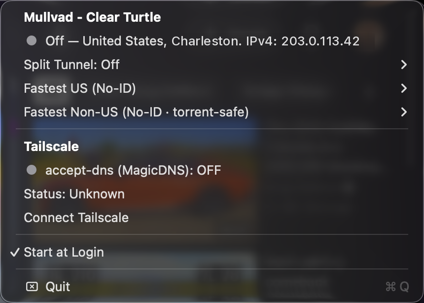

# vpn-dns-menubar

<p align="center"></p>



One macOS menu-bar icon that consolidates **Mullvad VPN** and **Tailscale** into a
single status dot, with a sectioned dropdown covering both apps — and a small
launchd watcher that keeps DNS working when Mullvad and Tailscale run at once.

The primary deliverable is the standalone **"VPN & DNS.app"** (see
"Standalone Swift app" below). The original
[SwiftBar](https://github.com/swiftbar/SwiftBar) plugin remains in the repo as a
retired fallback. Hide the two native Mullvad/Tailscale menu-bar icons (e.g. with
[Ice](https://github.com/jordanbaird/Ice)) and let this be the only one.

## What you see

The menu bar shows **one icon**: a single status dot that tracks Mullvad.

| State | Dot |
|-------|-----|
| Connected |  |
| Connecting / Disconnecting |  |
| Blocked |  |
| Off / disconnected |  |

Clicking it opens a dropdown, grouped into two bold section headers:

```
Mullvad - Fair Sheep                      ← bold section header, names this
  ●  Connected — Denver, CO                 machine's registered device
  Split Tunnel: On                       ▸ toggle + excluded-app list
  Fastest US (No-ID)                     ▸ top-5 cities, ✓ = current
  Fastest Non-US (No-ID · torrent-safe)  ▸
──────────────────────────────────────────
Tailscale                                 ← bold section header
  ●  accept-dns (MagicDNS): ON            → click toggles accept-dns
  Status: Running                         → click opens the Tailscale app
  Disconnect Tailscale
──────────────────────────────────────────
Start at Login
──────────────────────────────────────────
Quit
```

Section headers are bold, full-contrast, non-clickable; informational rows render
at full contrast too (never the faint disabled gray). **Status rows carry a colored
dot**: the Mullvad row reuses the menu-bar mapping (green connected · orange
connecting/disconnecting · red blocked · grey off), and clicking it toggles the
connection — connect goes to Mullvad's own persisted relay selection (whatever
was last chosen via the fast-city submenus or the native app);
the accept-dns row is green (ON) / grey (OFF), and clicking it toggles
`tailscale set --accept-dns`. That toggle is a *temporary override* — the DNS
watcher (below) re-asserts its mapping on the next Mullvad connect/disconnect.

The two **fastest-city submenus** — "Fastest US (No-ID)" and "Fastest Non-US
(No-ID · torrent-safe)" — list the top-5 cities from the candidate list ranked by
latency. Clicking a city connects Mullvad to that city (setting the relay location
then running `mullvad connect`); clicking the currently-active city disconnects
(toggle behavior). A checkmark (✓) marks the city you're connected to, and a
freshness footer at the bottom of each submenu shows when the latencies were last
measured.

Latency is re-measured by direct ICMP pings (`/sbin/ping`) when the newest
measurement is older than **12 hours** (checked every 15 minutes and on
Mullvad-off transitions): normally while Mullvad is disconnected; if Mullvad is
connected and split tunneling is *already* on, the app temporarily adds
`/sbin/ping` to the split-tunnel exclusions so pings bypass the tunnel, verifies
the exclusion took (re-checking again before recording), then removes it. It
never turns split tunneling on or off itself — connected + split-tunneling-off
just waits for the next off-window — and it hides the transient exclusion from
the Split Tunnel submenu (with a startup sweep so a crash can't leave it
behind). On first run, and until a live measurement completes, the app falls
back to seed values baked into `Resources/bundle/candidates.json`. Measurements
persist across restarts in
`~/Library/Application Support/VPNDNSMenuBar/latency.json`. To refresh the
candidate list (update which cities qualify under No-ID rules):

```sh
scripts/refresh-candidates.sh
```

## Requirements

- macOS 13+ (the Swift app's platform floor)
- Xcode Command Line Tools (Swift 5.9+) to build the app — `xcode-select --install`
- [Mullvad VPN](https://mullvad.net/) (CLI at `/usr/local/bin/mullvad`) and
  [Tailscale](https://tailscale.com/) (the Mac app, not the standalone CLI)
- Optional: [Ice](https://github.com/jordanbaird/Ice) to hide the native icons;
  [SwiftBar](https://github.com/swiftbar/SwiftBar) (`brew install --cask swiftbar`)
  only if you wire the retired plugin fallback

## Install

```sh
git clone https://github.com/nicholaspsmith/vpn-dns-menubar.git
cd vpn-dns-menubar
./install.sh
```

`install.sh` is idempotent and:

1. **Builds "VPN & DNS.app"** (`scripts/build-app.sh`), symlinks it into
   `~/Applications` (SMAppService requires that location; the repo's `build/`
   stays the source of truth so rebuilds propagate), and opens it.
2. Generates the launchd plist from the template and **bootstraps the DNS-sync
   agent** (`com.nicholassmith.mullvad-tailscale-dns`).

Then use the menu's **Start at Login** toggle and hide the native
Mullvad/Tailscale icons. No Accessibility/Automation permission is needed.

`./install.sh --swiftbar` additionally symlinks the retired plugin fallback
`vpn-dns-control.5s.sh` into `~/.config/SwiftBar/` (override with
`SWIFTBAR_PLUGIN_DIR`) and refreshes SwiftBar — that path *does* need SwiftBar
granted Accessibility + Automation for its Mullvad row's native popover.

## Repo layout

| Path | Role |
|------|------|
| `vpn-dns-control.5s.sh` | **The SwiftBar plugin (retired fallback).** Symlinked into SwiftBar's plugin dir by `--swiftbar`; refresh interval (`.5s.`) is in the filename. |
| `assets/open-native-menu.sh` | Helper: `… mullvad\|tailscale` → AX-clicks the app's menu-bar item to open its native menu. |
| `assets/mullvad.png`, `tailscale.png` | App icons shown on the dropdown rows. |
| `assets/menubar-{green,orange,red,grey}.png` | Dot-only icons (24×44, 16px dot). **Unused fallback** — the bar is now an SF Symbol; kept in case the PNG route is wanted again. |
| `dns-watcher/mullvad-tailscale-dns-sync.sh` | The launchd watcher (driven by `mullvad status listen`): toggles Tailscale `accept-dns` with Mullvad state. |
| `dns-watcher/com.nicholassmith.mullvad-tailscale-dns.plist` | LaunchAgent template (`__SCRIPT__` filled in by `install.sh`). |
| `install.sh` | Build + link the app and load the agent (`--swiftbar` also wires the plugin fallback). |

> ⚠️ **Only the plugin may live in SwiftBar's plugin dir.** SwiftBar loads *every*
> file there as its own menu-bar item, so a stray script/PNG/README would create
> phantom icons. That's why the assets live in `assets/` and only the plugin is
> symlinked.

## The dot: size & color (SwiftBar plugin fallback)

(The Swift app draws its dot natively via StatusItemKit; this section applies
only to the retired plugin.) The dot is an **inline SF Symbol token** — the
literal `:circle.fill:` in the plugin's title *text* — colored with `sfcolor`
and sized with `sfsize=6`:

```sh
echo ":circle.fill: | sfcolor=${mv_color} sfsize=6"
```

Knobs: change `sfsize` to resize, add `valign=-1` (or similar) if it sits too
high/low.

> **Hard-won gotcha.** The `sfimage=` *parameter* ignores both `size=` and
> `sfsize=` — SwiftBar forces it to `SymbolConfiguration(scale: .large)`, i.e. a
> giant dot. Only SF Symbols written **inline** as a `:token:` in the title text
> honor `sfsize` (verified in SwiftBar's source: `symbolize()` builds the symbol
> with `SymbolConfiguration(pointSize: sfsize ?? font.pointSize, ...)`).

## Native menu opening (the AX trick — SwiftBar plugin fallback)

(The Swift app no longer uses this: its Mullvad row toggles the connection via
the CLI instead.) macOS has no API to *re-open* another app's menu-bar
dropdown, so `assets/open-native-menu.sh` simulates a click on the status item
via System Events:

```applescript
tell application "System Events" to tell process "Mullvad VPN" to click menu bar item 1 of menu bar 2
```

This needs SwiftBar granted Accessibility + Automation. **Caveat:** a native menu
anchors to its icon's on-screen position, so if Ice hides the icon off-screen the
menu can pop off-screen. Tailscale therefore uses `open -a Tailscale` instead of its
native menu; Mullvad still uses the native popover.

## The DNS watcher (separate but related — the original problem)

Connecting Mullvad while Tailscale runs broke **all** DNS (no web, no iMessage):
Tailscale's DNS proxy (`accept-dns` / CorpDNS) forwards every query to a resolver
that's unreachable through Mullvad's tunnel. The fix is a launchd watcher that
disables Tailscale `accept-dns` while Mullvad is up and restores it the moment
Mullvad disconnects — event-driven via `mullvad status listen`, no polling.

While Mullvad is connected, MagicDNS is off and the tailnet is unreachable (Mullvad
split-tunnel can't exclude Tailscale's system network extension — tested, doesn't
work). So reaching a tailnet host means `mullvad disconnect` → do the thing →
`mullvad connect`.

## Rebuilding the icons (SwiftBar plugin fallback)

(The Swift app has no PNG assets — its dot is drawn in code.) The plugin's
menu-bar **dot** needs no rebuild — it's an SF Symbol; resize via `sfsize=`.
Only the **dropdown-row** icons are PNGs (run from the repo root):

```sh
sips -s format png -z 36 36 "/Applications/Mullvad VPN.app/Contents/Resources/icon.icns" --out assets/mullvad.png
sips -s format png -z 36 36 "/Applications/Tailscale.app/Contents/Resources/AppIcon.icns"  --out assets/tailscale.png
open "swiftbar://refreshallplugins"
```

<details><summary>Fallback: rebuilding the dot-only menu-bar PNGs (unused)</summary>

Only needed if you switch the plugin's title line back to an `image=` PNG. Resize
via the circle radius (gap between the two points, here 22−14=8px) and/or the canvas
height, keeping the dot vertically centered.

```sh
for nc in green:#30d158 orange:#ff9f0a red:#ff453a grey:#98989d; do
  n=${nc%%:*}; c=${nc##*:}
  magick -size 24x44 xc:none \
    -fill "$c" -stroke "#00000040" -strokewidth 1 -draw "circle 12,22 12,14" \
    "assets/menubar-$n.png"
done
open "swiftbar://refreshallplugins"
```

</details>

## Standalone Swift app

The repo's primary deliverable is a standalone Swift menu-bar app,
`VPNDNSMenuBar` (bundle **"VPN & DNS.app"**), built on
[StatusItemKit](https://github.com/nicholaspsmith/StatusItemKit). It polls
`mullvad`/`tailscale` every 5s, shows the colored menu-bar dot, and builds the
sectioned dropdown described under "What you see": bold section headers, per-row
status dots, top-5 fastest-city submenus, the registered Mullvad device in the
group header, and click-to-toggle rows (Mullvad connection, Tailscale,
accept-dns). All output
parsing, label text, and probe/staleness decisions live in a pure, unit-tested
`VPNDNSCore` library.

```sh
./scripts/build-app.sh   # build/VPN & DNS.app (stable self-signed identity if present, else ad-hoc)
open "build/VPN & DNS.app"
```

Clicking the Mullvad row toggles the connection via the `mullvad` CLI —
connect goes to Mullvad's own persisted relay selection. (The old AppleScript
AX-click that opened the native popover is gone, and with it the app's
Accessibility/Automation requirement.) The SwiftBar plugin remains in the repo
unchanged, and the launchd DNS-sync agent under `dns-watcher/` is shared.

### Start at Login

Two ways to launch it automatically (use **one**, not both, or it may start twice):

- **In-app toggle** — the menu's **Start at Login** item registers the app via
  `SMAppService` (bundle-ID based, not a LaunchAgent). macOS requires the app to
  live in `/Applications` or `~/Applications`, so point a symlink there first
  (e.g. `~/Applications/VPN & DNS.app` → `build/VPN & DNS.app`), then toggle it.
- **macOS Login Items** — add the app under System Settings → General → Login Items
  ("Open at Login"). Same effect, and it doesn't require the in-app toggle.

## Uninstall

```sh
# app (toggle Start at Login off in the menu first, or remove it from Login Items)
pkill -x VPNDNSMenuBar
rm ~/Applications/"VPN & DNS.app"

# plugin (only if wired via --swiftbar)
rm ~/.config/SwiftBar/vpn-dns-control.5s.sh

# DNS watcher
launchctl bootout "gui/$(id -u)/com.nicholassmith.mullvad-tailscale-dns"
rm ~/Library/LaunchAgents/com.nicholassmith.mullvad-tailscale-dns.plist
tailscale set --accept-dns=true   # restore default

# then re-show the native icons (relaunch the apps or drag them out of Ice)
```

## License

[MIT](LICENSE)

## The menu-bar suite

Part of a suite of macOS menu-bar apps that share one framework, one
build-and-sign script, and one installer. They are designed to sit in the
same bar together: consistent menus, a common **Icon** picker for shape and
colour, and cooperative hiding so no icon strands another.

| App | What it does |
|---|---|
| [Claude Usage](https://github.com/nicholaspsmith/claude-usage-menubar) | Claude Code plan limits, resets, and live agent sessions |
| [Apollo Monitor](https://github.com/nicholaspsmith/apollo-monitor-menubar) | Universal Audio Apollo monitor level, plus a UA process watchdog |
| [Battery Time](https://github.com/nicholaspsmith/battery-time-menubar) | Time remaining, power mode, and 24h usage |
| **VPN & DNS** | One dot for Mullvad + Tailscale state, with a DNS watcher |
| [Process Monitor](https://github.com/nicholaspsmith/MacOS_Process_Monitor) | Process-count sparkline against the per-UID limit |
| [KeyLight](https://github.com/nicholaspsmith/keylight-menubar) | Ctrl+brightness keys remapped to keyboard backlight |
| [MacRecorder](https://github.com/nicholaspsmith/MacRecorder) | Screen recording with system audio |
| [Media Tracking Killer](https://github.com/nicholaspsmith/media-tracking-killer-menubar) | Kills Apple's media tracking daemons |
| [Download Recycler](https://github.com/nicholaspsmith/download-recycler-menubar) | Sweeps stale files out of ~/Downloads |
| [Curtain](https://github.com/nicholaspsmith/menubar-curtain) | Hides a block of status icons by width, so it cannot strand one |

| Framework | |
|---|---|
| [StatusItemKit](https://github.com/nicholaspsmith/StatusItemKit) | Status-item lifecycle, polling, menus, meter icons, the shared Icon picker |
| [HotkeyKit](https://github.com/nicholaspsmith/HotkeyKit) | CGEventTap engine for intercepting and remapping global keys |

Install the whole suite on a fresh Mac with
[macOS Dev Environment Setup](https://github.com/nicholaspsmith/MacOS-Dev-Environment-Setup):

```bash
git clone https://github.com/nicholaspsmith/MacOS-Dev-Environment-Setup.git
cd MacOS-Dev-Environment-Setup && ./bootstrap.sh --all
```
