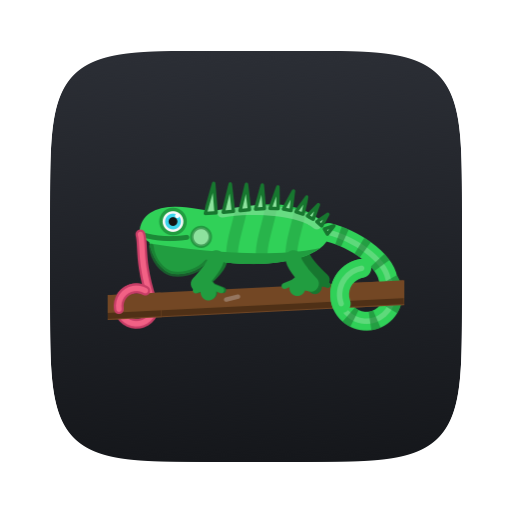
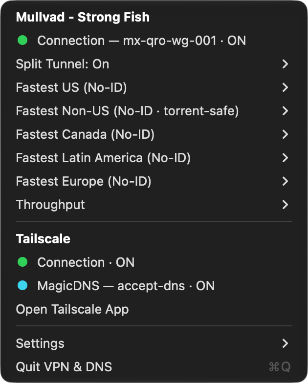

# vpn-dns-menubar

<p align="center"></p>

<p align="center">Part of the <a href="https://widgets.nicksmith.software">Menubarn</a> widget library.</p>



One macOS menu-bar icon that consolidates **Mullvad VPN** and **Tailscale** into a
single chameleon, with a sectioned dropdown covering both apps — and a small
launchd watcher that keeps DNS working when Mullvad and Tailscale run at once.

The primary deliverable is the standalone **"VPN & DNS.app"** (see
"Standalone Swift app" below). The original menu-bar plugin it replaced is
still in the repo (`vpn-dns-control.5s.sh`, wired only by `./install.sh
--swiftbar`) but is retired and undocumented here. Hide the two native
Mullvad/Tailscale menu-bar icons (e.g. with
[Barn](https://github.com/nicholaspsmith/menubar-barn)) and let this be the only one.

**Version 1.1.0** · [Changelog](https://github.com/nicholaspsmith/vpn-dns-menubar/releases)

## What you see

The menu bar shows **one icon**: a chameleon.


It sits on a branch in resting olive while nothing is connected. Each connection
is one thing the animal does, so the icon says all of them at once:

- **Tailscale running:** the tail comes down off its back and wraps around the
  branch. Otherwise it stays rolled up behind it.
- **Mullvad connected:** the tongue shoots out and wraps the branch ahead of it.
- **accept-dns (MagicDNS) on:** its eye turns cyan — the same cyan the row's
  dot takes. Not green: the body is already green whenever a VPN is up, and a
  green iris inside it was a state you had to hunt for.
- **Either VPN up:** the body turns green; Mullvad's in-between states still
  borrow the dot's colours — orange while connecting or disconnecting, red when
  blocked.

Prefer the original dot? **menu ▸ Icon ▸ Dot**.

Clicking it opens a dropdown, grouped into two bold section headers:

```
Mullvad - Fair Sheep                      ← bold section header, names this
  ●  Connection — Denver, CO · ON           machine's registered device
  Split Tunnel: On                       ▸ toggle + excluded-app list
  Fastest US (No-ID)                     ▸ top-5 cities, ✓ = current
  Fastest Non-US (No-ID · torrent-safe)  ▸
  Fastest Canada (No-ID)                 ▸
  Fastest Latin America (No-ID)          ▸
  Fastest Europe (No-ID)                 ▸
  Fastest Asia (No-ID)                   ▸
  Fastest Lists                          ▸ rank by latency/throughput, tick/untick
                                           lists, Measure Throughput Now
──────────────────────────────────────────
Tailscale                                 ← bold section header
  ●  Connection · ON                      → click brings Tailscale up/down
  ◍  MagicDNS — accept-dns · ON           → click toggles accept-dns (cyan dot)
  Open Tailscale App
──────────────────────────────────────────
Start at Login
──────────────────────────────────────────
Quit
```

Section headers are bold, full-contrast, non-clickable; informational rows render
at full contrast too (never the faint disabled gray).

**The three status rows are the same row three times**: a coloured dot, a name,
whatever detail that row has, and the state as the last word — `Connection —
Denver, CO · ON` — and clicking any of them toggles what it describes. Mullvad's
dot reuses the menu-bar mapping (green connected · orange connecting or
disconnecting · red blocked · grey off) and its in-between states say so rather
than being forced into ON/OFF; connecting goes to Mullvad's own persisted relay
selection (whatever was last chosen via the fast-city submenus or the native
app). Tailscale's dot is green running · orange starting or needs-login · grey
otherwise, and its row brings the backend up or down. The MagicDNS row is cyan
(ON) / grey (OFF) — matching the chameleon's eye — and toggles
`tailscale set --accept-dns`. That toggle is a *temporary override* — the DNS
watcher (below) re-asserts its mapping on the next Mullvad connect/disconnect.

The **fastest-city submenus** list the top-5 cities from the candidate list
ranked by latency or, if you prefer, by measured throughput (see below). "Fastest US" and "Fastest Non-US" are the two halves of the
pool; "Canada", "Latin America" (Mexico, Colombia, Peru, Chile, Argentina),
"Europe" (Albania, Serbia, Ukraine) and "Asia" (Thailand, Philippines) slice the
non-US half by region — Israel is only in Non-US. Every list is No-ID: the pool
never contains a city outside it. Clicking a city connects Mullvad to that city
(setting the relay location then running `mullvad connect`); clicking the
currently-active city disconnects (toggle behavior). A checkmark (✓) marks the
city you're connected to, and a freshness footer at the bottom of each submenu
shows when the latencies and throughputs were last measured. **Fastest Lists ▸**
picks the ranking — **Rank by Latency** (default) or **Rank by Throughput** —
ticks/unticks which submenus appear (all six by default), and starts a
throughput run; every choice persists.

Latency is re-measured by direct ICMP pings (`/sbin/ping`) when the newest
measurement is older than **12 hours** (checked every 15 minutes and on
Mullvad-off transitions): normally while Mullvad is disconnected; if Mullvad is
connected and split tunneling is *already* on, the app temporarily adds
`/sbin/ping` to the split-tunnel exclusions so pings bypass the tunnel, verifies
the exclusion took (re-checking again before recording), then removes it. It
never turns split tunneling on or off itself — connected + split-tunneling-off
just waits for the next off-window — and it hides the transient exclusion from
the Split Tunnel submenu (with a startup sweep so a crash can't leave it
behind). On first run, and until a live measurement completes, the app falls
back to seed values baked into `Resources/bundle/candidates.json`. Measurements
persist across restarts in
`~/Library/Application Support/VPNDNSMenuBar/latency.json`.

**Throughput** is a different question from latency — a city 40 ms further
away can move data several times faster — and it can only be measured by
actually tunnelling through the relay. So a throughput run walks every
candidate city in turn (about 21 cities, roughly 15–20 s each, 6–7 minutes in
all): it sets the relay location, waits for the tunnel to land on that city,
then times a download from and an upload to Cloudflare's speed-test endpoints
(`speed.cloudflare.com/__down` and `__up`) — a probe first (10 MB down,
2 MB up), then a transfer sized to run about five seconds at the probed rate,
capped at Cloudflare's 90 MB per-request limit. A city whose tunnel or transfer
fails keeps its previous result. When it finishes, or you click
**Cancel**, it restores the relay constraint it found (`mullvad relay get`,
including a custom list) and reconnects or disconnects to match the state it
started in. A run is intrusive — your traffic hops cities for the duration and
long-lived connections (an ssh session, say) will drop — so it runs on demand
(**Fastest Lists ▸ Measure Throughput Now**; the item shows progress and the
top-level row reads "Fastest Lists · measuring 4/21") and automatically only
when all three hold: the newest result is older than **7 days**, Mullvad is
already disconnected, and there has been no keyboard or mouse input for 10
minutes (checked every 15 minutes). A run that has started always completes.

In throughput mode rows read `Chicago, IL — ↓ 412 ↑ 88 Mbps`, sorted by
download; cities never tested sink below every tested one as
`Chicago, IL — 24 ms · not tested`. Results persist in
`~/Library/Application Support/VPNDNSMenuBar/throughput.json`, separate from
the latency file. To refresh the candidate list (update which cities qualify
under No-ID rules):

```sh
scripts/refresh-candidates.sh
```

## Requirements

- macOS 13+ (the Swift app's platform floor)
- Xcode Command Line Tools (Swift 5.9+) to build the app — `xcode-select --install`
- [Mullvad VPN](https://mullvad.net/) (CLI at `/usr/local/bin/mullvad`) and
  [Tailscale](https://tailscale.com/) (the Mac app, not the standalone CLI)
- Optional: [Barn](https://github.com/nicholaspsmith/menubar-barn) to hide the native icons

## Install

```sh
git clone https://github.com/nicholaspsmith/vpn-dns-menubar.git
cd vpn-dns-menubar
./install.sh
```

`install.sh` is idempotent and:

1. **Builds "VPN & DNS.app"** (`scripts/build-app.sh`), symlinks it into
   `~/Applications` (SMAppService requires that location; the repo's `build/`
   stays the source of truth so rebuilds propagate), and opens it.
2. Generates the launchd plist from the template and **bootstraps the DNS-sync
   agent** (`com.nicholassmith.mullvad-tailscale-dns`).

Then use the menu's **Start at Login** toggle and hide the native
Mullvad/Tailscale icons. No Accessibility/Automation permission is needed.

### Start at Login

Toggle it from the menu, or from the shell:

```sh
"$HOME/Applications/VPN & DNS.app/Contents/MacOS/VPNDNSMenuBar" --login on       # or: off, status
```

`install.sh` already runs this for you. Start at Login is `SMAppService.mainApp`, which can only
register the calling process's own bundle — so nothing outside the app can turn
it on, and the command has to be the *installed* binary. A bare `--login`, or
`--login status`, only reports the current state and changes nothing.

## Repo layout

| Path | Role |
|------|------|
| `vpn-dns-control.5s.sh` | The retired menu-bar plugin, kept as a fallback (`./install.sh --swiftbar` wires it). |
| `assets/open-native-menu.sh` | Helper: `… mullvad\|tailscale` → AX-clicks the app's menu-bar item to open its native menu. |
| `assets/mullvad.png`, `tailscale.png` | App icons shown on the dropdown rows. |
| `assets/menubar-{green,orange,red,grey}.png` | Dot-only icons (24×44, 16px dot). **Unused fallback** — the bar is now an SF Symbol; kept in case the PNG route is wanted again. |
| `dns-watcher/mullvad-tailscale-dns-sync.sh` | The launchd watcher (driven by `mullvad status listen`): toggles Tailscale `accept-dns` with Mullvad state. |
| `dns-watcher/com.nicholassmith.mullvad-tailscale-dns.plist` | LaunchAgent template (`__SCRIPT__` filled in by `install.sh`). |
| `install.sh` | Build + link the app and load the agent. |

## The DNS watcher (separate but related — the original problem)

Connecting Mullvad while Tailscale runs broke **all** DNS (no web, no iMessage):
Tailscale's DNS proxy (`accept-dns` / CorpDNS) forwards every query to a resolver
that's unreachable through Mullvad's tunnel. The fix is a launchd watcher that
disables Tailscale `accept-dns` while Mullvad is up and restores it the moment
Mullvad disconnects — event-driven via `mullvad status listen`, no polling.

While Mullvad is connected, MagicDNS is off and the tailnet is unreachable (Mullvad
split-tunnel can't exclude Tailscale's system network extension — tested, doesn't
work). So reaching a tailnet host means `mullvad disconnect` → do the thing →
`mullvad connect`.

## Standalone Swift app

The repo's primary deliverable is a standalone Swift menu-bar app,
`VPNDNSMenuBar` (bundle **"VPN & DNS.app"**), built on
[StatusItemKit](https://github.com/nicholaspsmith/StatusItemKit). It polls
`mullvad`/`tailscale` every 5s, shows the colored menu-bar dot, and builds the
sectioned dropdown described under "What you see": bold section headers, per-row
status dots, top-5 fastest-city submenus, the registered Mullvad device in the
group header, and click-to-toggle rows (Mullvad connection, Tailscale,
accept-dns). All output
parsing, label text, and probe/staleness decisions live in a pure, unit-tested
`VPNDNSCore` library.

```sh
./scripts/build-app.sh   # build/VPN & DNS.app (stable self-signed identity if present, else ad-hoc)
open "build/VPN & DNS.app"
```

Clicking the Mullvad row toggles the connection via the `mullvad` CLI —
connect goes to Mullvad's own persisted relay selection. (The old AppleScript
AX-click that opened the native popover is gone, and with it the app's
Accessibility/Automation requirement.) The launchd DNS-sync agent under
`dns-watcher/` is shared with the retired plugin.

### Start at Login

Two ways to launch it automatically (use **one**, not both, or it may start twice):

- **In-app toggle** — the menu's **Start at Login** item registers the app via
  `SMAppService` (bundle-ID based, not a LaunchAgent). macOS requires the app to
  live in `/Applications` or `~/Applications`, so point a symlink there first
  (e.g. `~/Applications/VPN & DNS.app` → `build/VPN & DNS.app`), then toggle it.
- **macOS Login Items** — add the app under System Settings → General → Login Items
  ("Open at Login"). Same effect, and it doesn't require the in-app toggle.

## Uninstall

```sh
# app (toggle Start at Login off in the menu first, or remove it from Login Items)
pkill -x VPNDNSMenuBar
rm ~/Applications/"VPN & DNS.app"

# DNS watcher
launchctl bootout "gui/$(id -u)/com.nicholassmith.mullvad-tailscale-dns"
rm ~/Library/LaunchAgents/com.nicholassmith.mullvad-tailscale-dns.plist
tailscale set --accept-dns=true   # restore default

# then re-show the native icons (relaunch the apps, or unhide them in Barn)
```

## Releasing

Every push to `main` is a release. Before pushing, add a dated
`## [X.Y.Z] - YYYY-MM-DD` section to the top of [`CHANGELOG.md`](CHANGELOG.md)
(minor for features, patch for fixes; turn a waiting `## [Unreleased]` into
it). When it reaches `main`, GitHub tags `vX.Y.Z` and publishes the section as
a release titled `vX.Y.Z`. Without a new version:

- a push is refused locally by the `pre-push` hook;
- a pull request **cannot merge** — `release / check` is required on `main`;
- a push that reaches `main` anyway fails the release workflow.

The one exception is `[no release]` in the tip commit's message, for changes
nothing a user runs (setup, CI, developer docs): it passes every check with no
version bump and no tag. Never tag or create a release by hand, and never
`gh pr merge --admin` past a failing check — fix the PR. After merging, `git pull` for the tag and rebuild. `install.sh` re-arms the hook on a fresh clone.
See [StatusItemKit — Releases](https://github.com/nicholaspsmith/StatusItemKit#releases-every-push-is-one) for the whole rule.

## License

Copyright (c) 2026 Nicholas Smith. Licensed under the
[Mozilla Public License 2.0](LICENSE). You may use, modify, sell and
redistribute this software, including inside proprietary products, provided
the copyright notice and license stay on these files and any modified
versions of them are made available under the same license.

## Why not a SwiftBar plugin?

This is a standalone `.app` built on [StatusItemKit](https://github.com/nicholaspsmith/StatusItemKit), not a script under a plugin host: no SwiftBar to install, a real AppKit menu instead of rendered stdout, event-driven updates instead of a re-run timer, and an icon that keeps its place in the bar. The icon follows `mullvad status listen` the moment the tunnel changes instead of polling, and the app needs no Accessibility or Automation grant, which the retired plugin did. The full comparison is in [StatusItemKit's README](https://github.com/nicholaspsmith/StatusItemKit#why-not-swiftbar).

## The menu-bar suite

Part of a suite of macOS menu-bar apps that share one framework, one
build-and-sign script, and one installer. They are designed to sit in the
same bar together: consistent menus, a common **Icon** picker for shape and
colour, and cooperative hiding so no icon strands another.

| App | What it does |
|---|---|
| [Claude Usage](https://github.com/nicholaspsmith/claude-usage-menubar) | Claude Code plan limits, resets, and live agent sessions |
| [Apollo Monitor](https://github.com/nicholaspsmith/apollo-monitor-menubar) | Apollo audio-interface monitor level, plus a mixer-process watchdog |
| [Battery Time](https://github.com/nicholaspsmith/battery-time-menubar) | Time remaining, power mode, and 24h usage |
| **VPN & DNS** | A chameleon for Mullvad + Tailscale state, with a DNS watcher |
| [Process Monitor](https://github.com/nicholaspsmith/MacOS_Process_Monitor) | Process-count sparkline against the per-UID limit |
| [KeyLight](https://github.com/nicholaspsmith/keylight-menubar) | Ctrl+brightness keys remapped to keyboard backlight |
| [MacRecorder](https://github.com/nicholaspsmith/MacRecorder) | Screen recording with system audio |
| [Media Tracking Killer](https://github.com/nicholaspsmith/media-tracking-killer-menubar) | Kills Apple's media tracking daemons |
| [Download Recycler](https://github.com/nicholaspsmith/download-recycler-menubar) | Sweeps stale files out of ~/Downloads |
| [Barn](https://github.com/nicholaspsmith/menubar-barn) | Hides a block of status icons by width, so it cannot strand one |

| Framework | |
|---|---|
| [StatusItemKit](https://github.com/nicholaspsmith/StatusItemKit) | Status-item lifecycle, polling, menus, meter icons, the shared Icon picker |
| [HotkeyKit](https://github.com/nicholaspsmith/HotkeyKit) | CGEventTap engine for intercepting and remapping global keys |

Install the whole suite on a fresh Mac with
[macOS Dev Environment Setup](https://github.com/nicholaspsmith/MacOS-Dev-Environment-Setup):

```bash
git clone https://github.com/nicholaspsmith/MacOS-Dev-Environment-Setup.git
cd MacOS-Dev-Environment-Setup && ./bootstrap.sh --all
```
